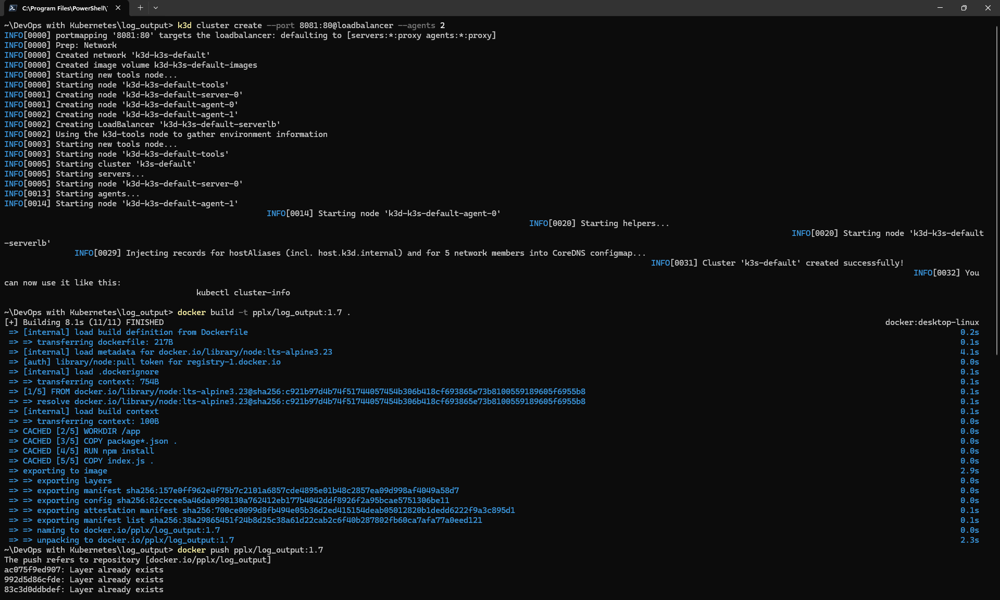
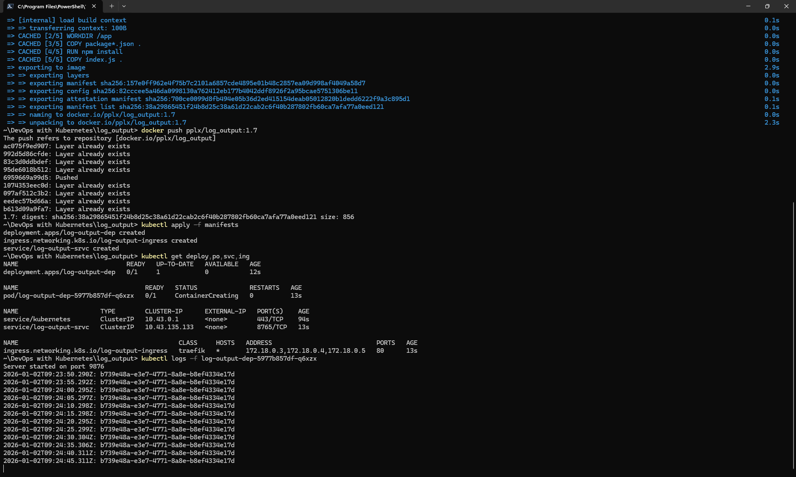
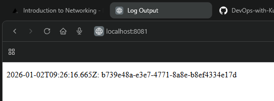
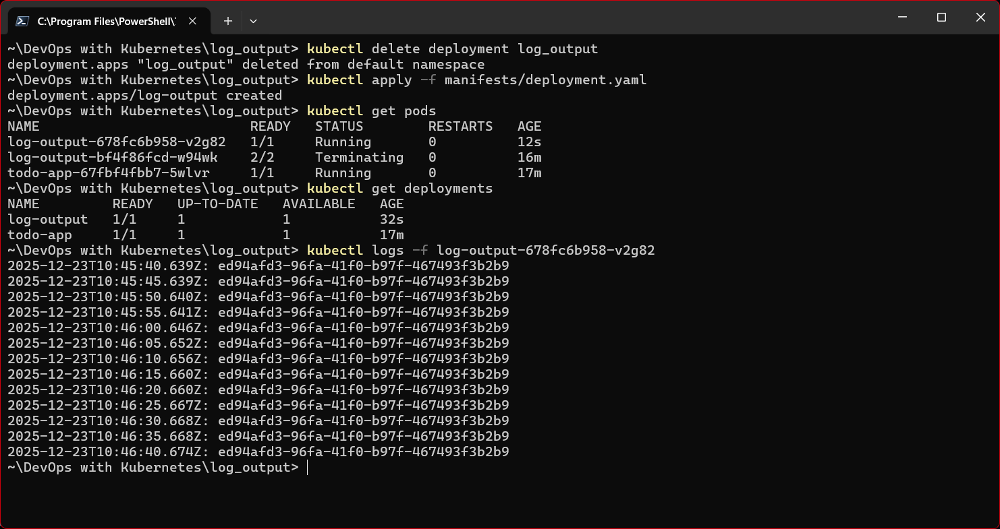
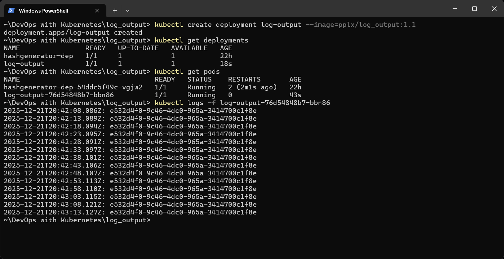

# Log Output

## Exercises

### Exercise 1.7

- Create a cluster with a port open to load balancer.
    - ```k3d cluster create --port 8081:80@loadbalancer --agents 2```
- Update the applikcation Docker image.
    - ```docker build -t pplx/log_output:1.7 .```
    - ```docker push pplx/log_output:1.7```  

- Create ```service.yaml``` and ```ingress.yaml``` and apply them
    - ```kubectl apply -f manifests```
- Verify deployments
    - ```kubectl get deploy,po,svc,ing```
- Verify app logs 
    - ```kubectl logs -f log-output-dep-5977b857df-q6xzx```  

- Open ```http://localhost:8081/``` in browser to see the output.  



### Exercise 1.3

- To create deployment and check it, run the following commands:
    - ```kubectl apply -f manifests/deployment.yaml```
    - ```kubectl get pods```
    - ```kubectl get deployments```
    - ```kubectl logs -f log-output-678fc6b958-v2g82```


### Exercise 1.1

- The application is built using Node.js. Source code is available [here](./).
- The image pushed to Docker Hub is available at [pplx/log_output](https://hub.docker.com/r/pplx/log_output).
- Docker commands used in this exercise are:
    - ```docker build -t pplx/log_output:1.1 .```
    - ```docker push pplx/log_output:1.1```
- Kubernetes commands used in this exercise are:
    - ```kubectl create deployment log-output --image=pplx/log_output:1.1```
    - ```kubectl get deployments```
    - ```kubectl get pods```
    - ```kubectl logs -f log-output-76d54848b7-bbn86```
