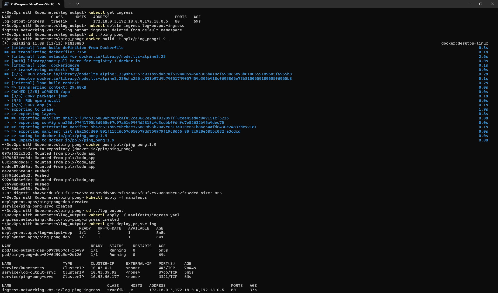
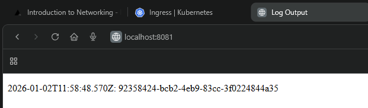
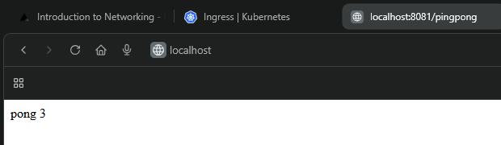

# Ping Pong

## Exercises

### Exercise 1.9

- Use the existing cluster created with:
    - ```k3d cluster create --port 8081:80@loadbalancer --agents 2```
- Delete the existing ingress:
    - ``` kubectl get ingress```
    - ```kubectl delete ingress log-output-ingress```
- Create the application Docker image
    - ```docker build -t pplx/ping_pong:1.9 .```
    - ```docker push pplx/ping_pong:1.9```  
- Create ```service.yaml``` and ```deployment.yaml``` and apply them
    - ```kubectl apply -f manifests```
- Update ```ingress.yaml``` and apply it
    - ```kubectl apply -f manifests/ingress.yaml```
- Verify deployments
    - ```kubectl get deploy,po,svc,ing```

- Navigate to ```http://localhost:8081/``` to see Log Output app running  
  
- Navigate to ```http://localhost:8081/pingpong``` to see Ping Pong app running  

