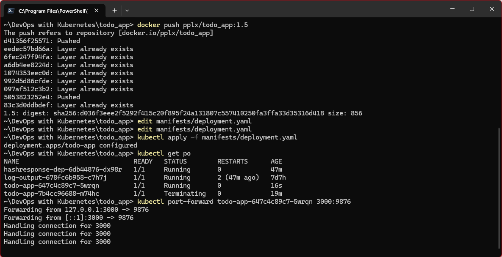
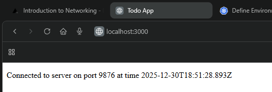
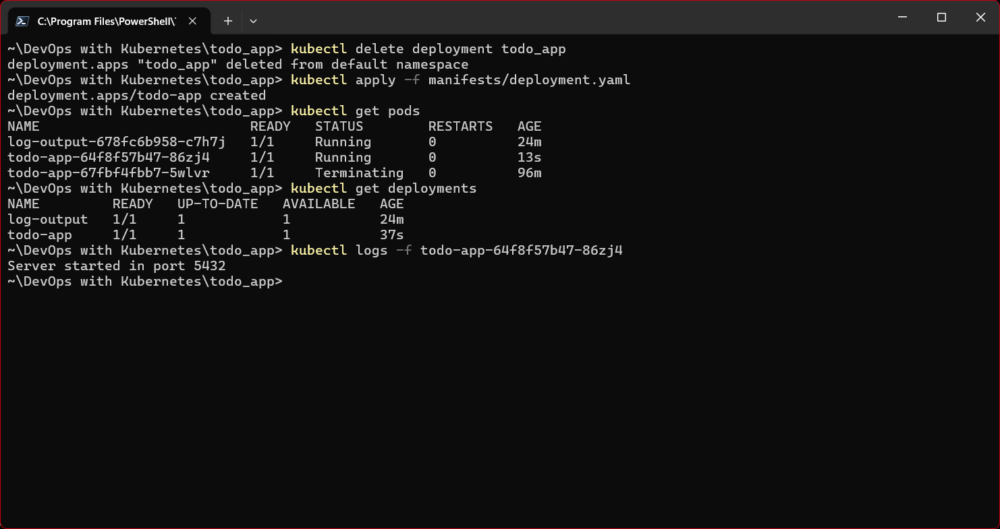
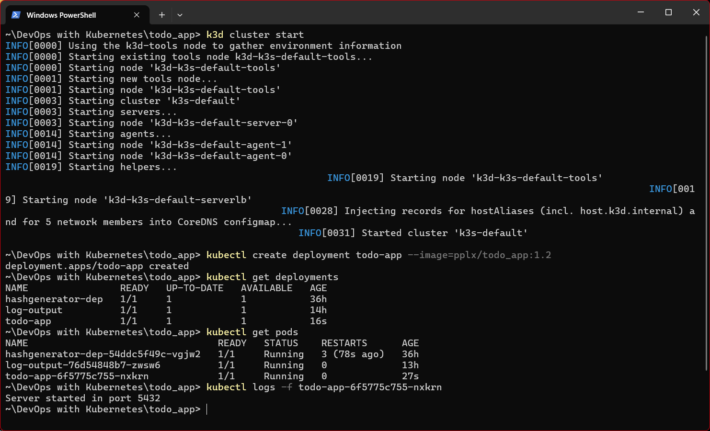

# Log Output

## Exercises

### Exercise 1.5

- Update the app to handle simple get request and push the updated image to Dockerhub with new tag.
    - ```docker build -t pplx/todo_app:1.5 .```
    - ```docker push pplx/todo_app:1.5```
- Update the deployment and run the following commands:
    - ```kubectl apply -f manifests/deployment.yaml```
    - ```kubectl get pods```
    - ```kubectl port-forward todo-app-647c4c89c7-5wrqn 3000:9876```

- Check the run on ```http://localhost:3000/```


### Exercise 1.4

- To create deployment and check it, run the following commands:
    - ```kubectl apply -f manifests/deployment.yaml```
    - ```kubectl get pods```
    - ```kubectl get deployments```
    - ```kubectl logs -f todo-app-64f8f57b47-86zj4```


### Exercise 1.2

- The application is built using Node.js. Source code is available [here](./).
- The image pushed to Docker Hub is available at [pplx/todo_app](https://hub.docker.com/r/pplx/todo_app).
- Docker commands used in this exercise are:
    - ```docker build -t pplx/todo_app:1.2 .```
    - ```docker push pplx/todo_app:1.2```
- Kubernetes commands used in this exercise are:
    - ```kubectl create deployment todo-app --image=pplx/todo-app:1.2```
    - ```kubectl get deployments```
    - ```kubectl get pods```
    - ```kubectl logs -f todo-app-6f5775c755-nxkrn```
